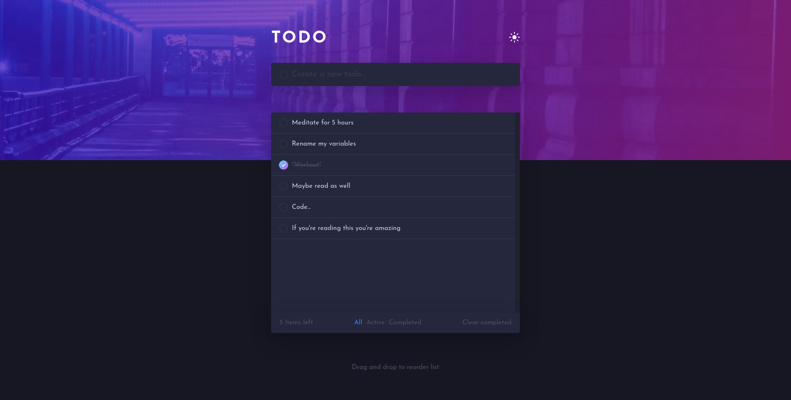
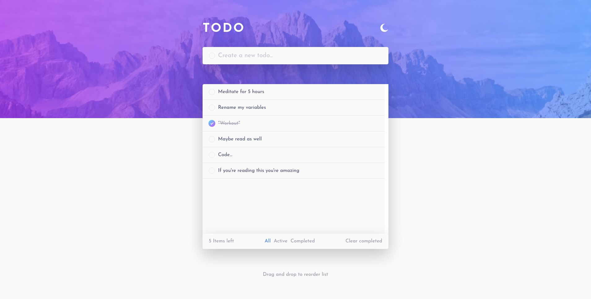
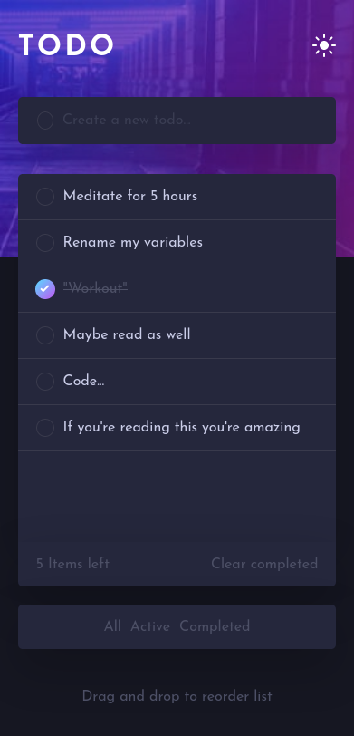
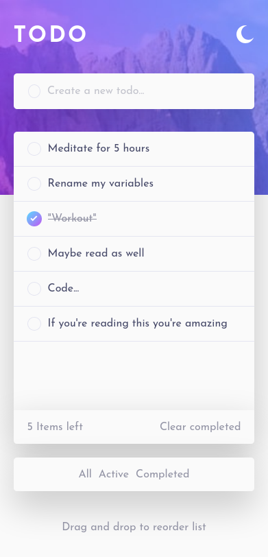

# Frontend Mentor - Pomodoro app solution

This is a solution to the [Todo app challenge on Frontend Mentor](https://www.frontendmentor.io/challenges/todo-app-Su1_KokOW). Frontend Mentor challenges help you improve your coding skills by building realistic projects.

## Table of contents

- [Overview](#overview)
  - [The challenge](#the-challenge)
  - [Screenshot](#screenshot)
  - [Links](#links)
- [My process](#my-process)
  - [Built with](#built-with)
  - [What I learned](#what-i-learned)
  - [Added Features](#added-features)
  - [Useful resources](#useful-resources)
- [Author](#author)

## Overview

### The challenge

Users should be able to:

- View the optimal layout for the app depending on their device's screen size.
- See hover states for all interactive elements on the page.
- Add new todos to the list.
- Mark todos as complete.
- Delete todos from the list.
- Filter by all/active/complete todos.
- Clear all completed todos.
- Toggle light and dark mode.
- Bonus: Drag and drop to reorder items on the list.

### Screenshot

### Links

- Live Site URL: [Todo App](https://todo-app-fem.netlify.app/)

## My process

- Using mobile first approach to build the app and make sure it's responsive.
- Setting up drag and drop feature, and dark mode toggle
- Use javascript Classes to structure the app.

### Built with

- Semantic HTML5 markup.
- CSS custom properties.
- CSS Flexbox.
- SASS.
- JavaScript.
- Parcel for development.

### What I learned

- JavaScript classes.
- JavaScript modules and basic use of Parcel.
- Drag and drop API

### Added Features

- Display message if the user tries to add an empty task.
- Drag tasks to rearrange.
- Save user settings and list in the browser storage

### Useful resources

- [How To Build Sortable Drag & Drop With Vanilla Javascript](https://www.youtube.com/watch?v=jfYWwQrtzzY)
- [Unique id generator in javascript](https://learnersbucket.com/examples/javascript/unique-id-generator-in-javascript/)

## Author

- Frontend Mentor - [@faissalabsml](https://www.frontendmentor.io/profile/faissalabsml)
- Twitter - [@faissalabs](https://twitter.com/faissalabs)
